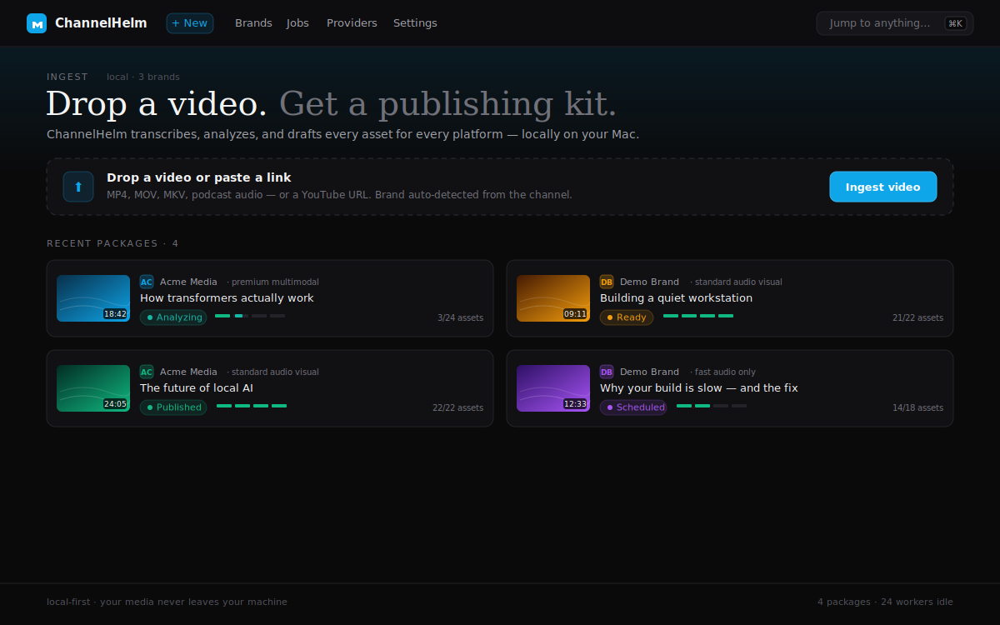
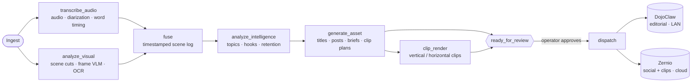
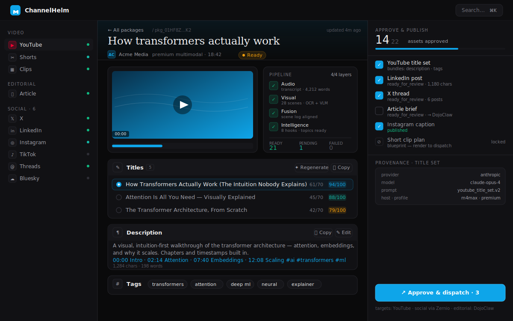
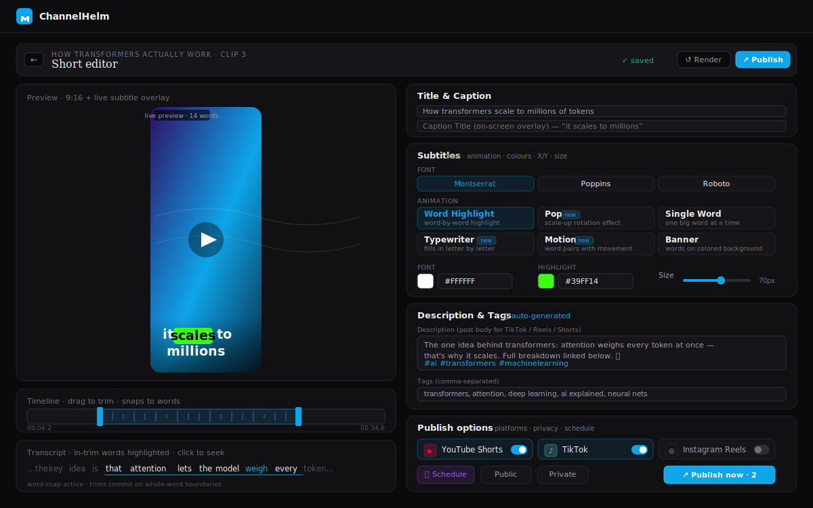
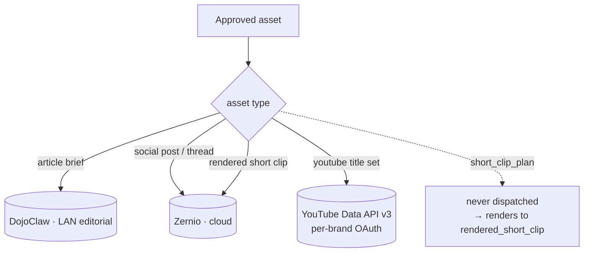
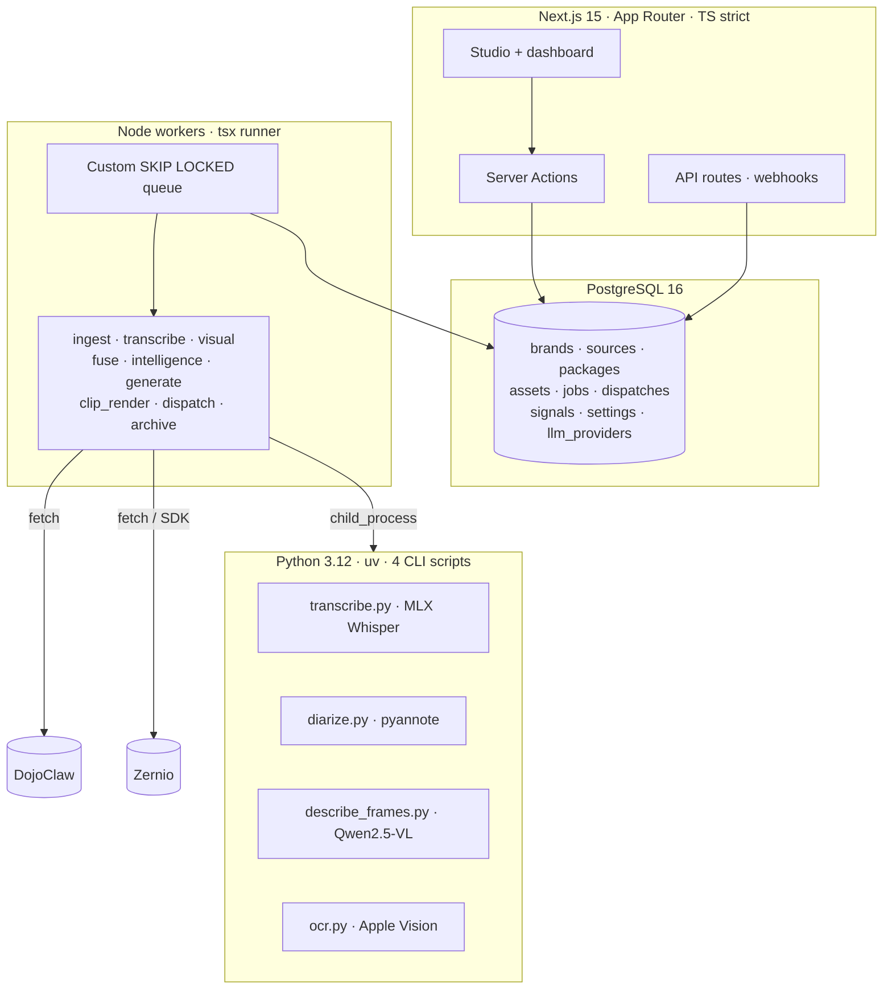

<div align="center">

# ChannelHelm

### Drop a video. Get a publishing kit.

**A local-first video-to-publishing command center.** Feed it a video — uploaded file, YouTube URL, podcast, webinar — and it watches the audio, the visuals, and the meaning, then drafts every asset for every platform. You review, edit, approve, and ship. Your media never leaves your machine.

[](LICENSE)


**[🌐 channelhelm.com](https://channelhelm.com/) · [GitHub](https://github.com/MeyerThorsten/ChannelHelm)**

</div>

---



> One upload needs a YouTube title, description, chapters, tags and a thumbnail; short-clip cuts; a blog draft; and a post for every social network — each on-brand, each different. ChannelHelm does the first draft of all of it, locally, in one pass.

## Why ChannelHelm

| | |
|---|---|
| 🧠 **It understands the video** | Not just a transcript — a four-layer read of what's *said*, what's *shown*, and what *matters*, fused into one timestamped scene log. |
| 📦 **It produces a Package** | One source video becomes a canonical **Publishing Package**: every derivative asset, each carrying full provenance (which model, prompt version, and inputs produced it). |
| 🔒 **It stays on your machine** | Local-first by design. The only external dependency is your social-publishing API. Your media and transcripts never touch a cloud SaaS. |
| 🔌 **Bring your own model** | Pluggable LLM providers — OpenAI, Anthropic, OpenRouter, Ollama, LM Studio, OpenClaw, or a local Codex CLI — routed per task or as a default. Image providers too (Runware Flux / Z-Image) for AI thumbnails. |

## How it works

Four understanding layers feed an intelligence brief; every asset is drafted from it. Background workers do the heavy lifting; the app enqueues and reviews.



| Layer | What it extracts |
|-------|------------------|
| **① Audio** | Transcription (MLX Whisper large-v3) + speaker diarization, with word-level timestamps. |
| **② Visual** | Scene-cut detection, frame descriptions (Qwen2.5-VL), and on-screen text (Apple Vision OCR). |
| **③ Fusion** | Audio + visual aligned into a single timestamped scene log. |
| **④ Intelligence** | Topics, hooks, and retention windows — the brief every asset is drafted from. |

Every package runs under a **processing profile** — `transcription_only`, `fast_audio_only`, `standard_audio_visual`, or `premium_multimodal` — which controls how deep the visual + diarization passes go. `transcription_only` is the cheapest (audio transcription only, no visual phase or diarization) and powers Backlog Revival.

## The Studio

The per-package review is where you live. Read scored options, edit inline, regenerate a section, or generate one on demand — and watch the rest fill in as the pipeline completes.



- **Scored, legible options** — titles and tags carry 0–100 scores against character budgets, so the best pick is obvious at a glance, then editable inline.
- **Regenerate anything** — don't like a section? Regenerate just that one. Empty section? Generate it on demand straight from the transcript.
- **Pipeline you can see** — a four-layer progress indicator shows exactly what's done and what's still generating. Partially-ready is a first-class state.
- **Provenance on everything** — every generated asset records the model, provider, prompt version, and inputs that produced it. Nothing is a black box.
- **Backlog Revival** — a ♻ Revive button re-mines an existing source through the pipeline with your current prompts (defaults to the cheap `transcription_only` profile), so old videos benefit from newer analysis without re-downloading.

## The Shorts editor

Each high-retention moment becomes a ready-to-ship vertical Short. The editor is the 2-minute review-and-publish loop: trim on word boundaries, style the captions, preview live, publish.



- **Word-snap trimming** — drag the trim handles freely; they snap to whole-word boundaries on release. A clip never starts or ends mid-word (enforced client-side *and* server-side).
- **Six animated subtitle styles** — Word Highlight · Pop · Single Word · Typewriter · Motion · Banner, burned in via an ASS subtitle pipeline.
- **Live subtitle preview** — see styling changes instantly as a DOM overlay on the preview video, with **no render** required.
- **Auto-written descriptions** — an empty clip description is generated from the clip's transcript, title, and your brand voice.
- **Per-clip publishing** — platform toggles, privacy, and scheduling; one post fans out to TikTok + Instagram + YouTube Shorts.

The `short_clip_plan` asset is the **editable source of truth**; `rendered_short_clip` is a build output that the `clip_render` worker UPSERTs (keyed by plan + clip index, idempotent via `render_rev`) — so re-renders never lose your edits.

## What you get

One ingest produces the whole kit — scored where it counts, editable everywhere.

| Group | Assets |
|-------|--------|
| ▶ **YouTube** | Scored title options · full description with chapters + hashtags · scored tags · AI-generated thumbnails (Runware) — plain + headline-overlay variants — with ffmpeg frame-extraction as a zero-config fallback · a pinned comment to seed discussion · clean transcript |
| ✂ **Clips & Shorts** | Short-clip plans cut from the highest-retention moments · rendered vertical clips · long-form highlight cuts (horizontal `long_clip_plan` → `rendered_long_clip`) |
| 📄 **Editorial** | Article briefs and blog drafts · newsletter summaries · routed to your editorial service |
| 𝕏 **Social** | LinkedIn posts · X posts & threads — plus per-network posts for Facebook, Threads, Bluesky, Reddit, Pinterest, Telegram, Discord & Google Business, drafted in your brand voice. Extended networks generate only for the accounts a brand has connected, so you never draft a post you can't ship. |

**Publishes to:** YouTube · X · LinkedIn · Instagram · TikTok · Facebook · Threads · Pinterest · Reddit · Bluesky · Telegram · Snapchat · WhatsApp · Discord · Google Business.

## Dispatch routing

`*_plan` assets are never dispatched — they're blueprints the `clip_render` worker consumes. Only rendered clips and text/editorial assets ship.



## Architecture



- **App** — Next.js 15 (App Router, TypeScript strict). Server Components by default, Server Actions for mutations, API routes for webhook receivers.
- **Database** — a single PostgreSQL 16 instance. Drizzle ORM with `drizzle-kit` migrations. ULIDs as `TEXT`.
- **Queue** — a custom ~150-line `SELECT FOR UPDATE SKIP LOCKED` queue. No Redis, no BullMQ. The queue is the only mutex; workers run N independent claim→run→ack slots (`--concurrency`, default 3).
- **ML** — exactly four Python CLI scripts in `ml/`, spawned via `child_process`. No FastAPI, no shared Python service.
- **Validation** — Zod schemas shared between API routes and workers. Every generated artifact carries a provenance wrapper.

## Quickstart

> Requires **Node ≥ 20**, **pnpm**, **PostgreSQL 16**, and (for the ML layer on Apple Silicon) **`uv`** + **ffmpeg** + **yt-dlp**.
>
> ℹ️ The headline-overlay thumbnails (`drawtext`) and burned-in Shorts captions (`ass`/`subtitles`) need an ffmpeg built with **libfreetype + libass**. If `ffmpeg -filters | grep drawtext` comes up empty, install the full build: `brew install ffmpeg-full && brew unlink ffmpeg && brew link --force --overwrite ffmpeg-full`. The `clip_render` and thumbnail workers probe for these filters and fail with a clear message if they're missing.

```sh
git clone https://github.com/MeyerThorsten/ChannelHelm.git
cd ChannelHelm
pnpm install

cp .env.example .env          # set DATABASE_URL + secrets (see Configuration)
pnpm db:migrate               # apply migrations to your Postgres
pnpm smoke:schema             # inserts brand → source → package, prints, cleans up

pnpm dev:all                  # web server + worker daemon together
```

Open <http://localhost:3000>, add a video, and watch the pipeline fill the Studio. The app also serves a set of rich, illustrated guides — see [Documentation](#documentation).

### Common scripts

| Command | What it does |
|---------|--------------|
| `pnpm dev:all` | **Web server + worker daemon together** — generation auto-starts when you add a video. |
| `pnpm dev` | Next.js dev server only (queued jobs won't run until a worker starts). |
| `pnpm worker -- --kinds ingest,transcribe_audio,… --concurrency 3` | Worker daemon only. |
| `pnpm db:generate` / `pnpm db:migrate` | Generate / apply Drizzle migrations. |
| `pnpm typecheck` · `pnpm lint` · `pnpm test` | `tsc --noEmit` · Biome · Vitest. |
| `pnpm test:integration` | Vitest integration suite against a real Postgres (Testcontainers). |
| `pnpm smoke:runware` | End-to-end AI-thumbnail check: generate via the configured image provider → download → render plain + headline. |

## Configuration

Most settings are **runtime-editable** at `/settings` (DB-backed, hydrated into `process.env`, propagated live across processes via `pg_notify` — no restart). A handful are **boot-only** (`DATABASE_URL`, `MEDIA_ROOT`, `ARCHIVE_ROOT`, `LOCAL_BEARER_TOKEN`, `PROVIDER_SECRET_KEY`) and change only by editing `.env` and restarting.

Providers are **not** settings — they live in the `llm_providers` table and are managed at `/providers` (per-purpose routing, at-rest key encryption, test-connection). Two categories: **text** (LLMs — OpenAI, Anthropic, OpenRouter, Ollama, LM Studio, OpenClaw, Codex CLI) and **image** (text-to-image — Runware Flux / Z-Image), the latter powering AI thumbnail generation. With no image provider configured, thumbnails fall back to ffmpeg frame extraction. See [`.env.example`](.env.example) for the full template.

## Storage lifecycle

ChannelHelm cleans up after itself:

- **Inline cleanup** — transient pipeline artifacts (extracted audio, sampled frames, intermediate JSON) are deleted at the end of each worker once consumed. Set `KEEP_PIPELINE_ARTIFACTS=1` to retain them for debugging.
- **Post-publish archive** — an optional `archive_package` worker moves published source video + clips to an external `ARCHIVE_ROOT` after `ARCHIVE_AFTER_DAYS` (default 14), keeping local disk lean while staying re-render-capable.

## Documentation

📜 **The load-bearing spec** every component mirrors is the technical contract: [`docs/channelhelm-technical-contract-v1.md`](docs/channelhelm-technical-contract-v1.md). When the contract and the code disagree, the contract wins.

The app also ships a set of illustrated, in-app guides (served from `public/`, open them at `http://localhost:3000/<page>`):

| Page | What it covers |
|------|----------------|
| `/how-it-works.html` | The pipeline end-to-end, with diagrams. |
| `/handbook.html` | The full operator handbook. |
| `/setup-guide.html` | Zero-to-running install + boot order. |
| `/shorts-editor-guide.html` | The Shorts editor in depth. |
| `/llm-routing.html` | Which LLM for which task; provider resolution. |
| `/worker-concurrency.html` | The SKIP LOCKED queue + concurrency model. |
| `/visual-optimization-analysis.html` | The visual-phase performance work. |
| `/storage-lifecycle.html` | What's temporary, archivable, and permanent. |
| `/youtube-publish-options.html` | The three YouTube publishing paths. |
| `/ab-testing-guide.html` | Self-run title/thumbnail A/B testing + the feedback loop. |

## Project layout

```
channelhelm/
├── src/
│   ├── app/                  # Next.js App Router (dashboard, studio, settings, API routes)
│   ├── components/           # Server + Client components (studio, shorts editor, ui)
│   ├── db/                   # Drizzle schema + client
│   ├── lib/                  # Zod schemas, settings, word-snap, ASS subtitles, …
│   └── server-actions/       # mutations (approve, regenerate, clip-edit, …)
├── workers/
│   ├── runner.ts             # claim → dispatch → ack loop
│   ├── queue.ts              # SKIP LOCKED queue (the only INSERTer to jobs)
│   ├── kinds/                # one file per job kind
│   └── integrations/         # ffmpeg, yt-dlp, ml subprocess, dojoclaw, zernio, llm
├── ml/                       # the only Python: transcribe / diarize / describe_frames / ocr
├── migrations/               # drizzle-kit generated SQL
├── prompts/                  # versioned asset prompts (prompts/{type}.v{N}.md)
└── public/                   # static assets + the in-app documentation pages
```

## Local-first by design

ChannelHelm v1 does **not** deploy to a cloud SaaS. It runs on your own machine (or Mac fleet). The only external network dependency is your social-publishing API; editorial routing goes to a local service over your LAN. Provider API keys are encrypted at rest (AES-256-GCM). Multi-brand is root: every entity is brand-scoped.

## Roadmap

See [`ROADMAP.md`](ROADMAP.md) for what's next — Backlog Revival (v1.1) shipped; the Helm Signal feedback loop (v1.5) is underway, with self-run **title/thumbnail A/B routing** the first slice to land ([guide](https://channelhelm.com/ab-testing-guide.html)); scale/identity work (v2) is ahead.

## Contributing

Issues and pull requests are welcome. Run `pnpm typecheck`, `pnpm lint`, and `pnpm test` before opening a PR.

## License

[MIT](LICENSE) © 2026 Thorsten Meyer.
