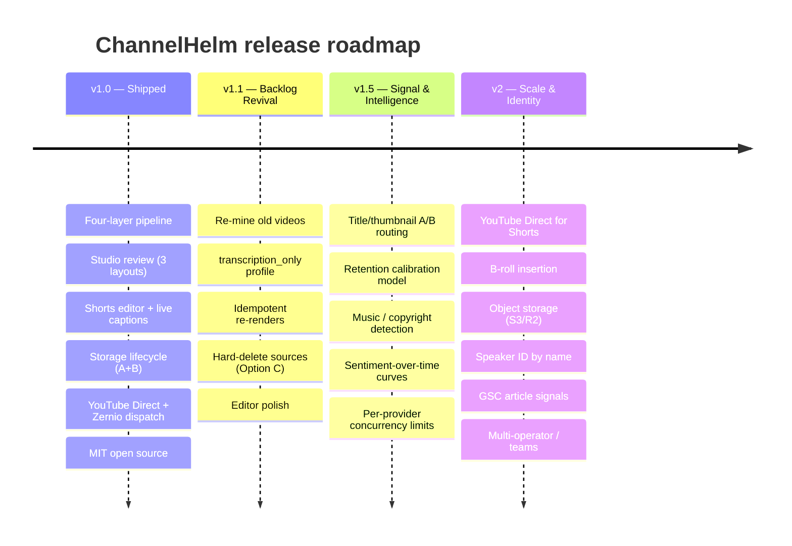

# ChannelHelm Roadmap

This roadmap reflects the milestones already defined in ChannelHelm's technical contract and the items documented as deferred across the codebase. It's a direction, not a contract — priorities and dates are the maintainer's call and may shift. Suggestions and PRs against any of these are welcome.

---

## ✅ v1.0 — Shipped

The current foundation, for context.

| Area | What landed |
|------|-------------|
| **Pipeline** | Four understanding layers (audio · visual · fusion · intelligence) → intelligence brief → asset generation, on a custom `SELECT FOR UPDATE SKIP LOCKED` queue with tunable worker concurrency. |
| **Studio** | Per-package review with scored options, inline edit, on-demand regeneration, and live pipeline status. |
| **Shorts editor** | Word-snap trimming, 6 ASS subtitle animations, live (no-render) subtitle preview, auto-written descriptions, per-clip publishing. |
| **Dispatch** | YouTube Direct (per-brand OAuth), Zernio (social + clips), DojoClaw (editorial). |
| **Storage** | Inline Stage-1 cleanup (Option A) + post-publish archive worker (Option B). |
| **Providers** | Pluggable LLM providers (OpenAI / Anthropic / OpenRouter / Ollama / LM Studio / OpenClaw / Codex CLI) with per-purpose routing + at-rest key encryption. |
| **Project** | MIT licensed, public, documented. |

---

## 🔜 v1.1 — Backlog Revival

The headline feature: **re-mine an existing back catalogue** with the current pipeline + prompts, so old uploads yield fresh publishing kits without re-recording. Backlog Revival has its own spec and extends the v1 contract. Bundled with near-term polish that makes re-running cheap and safe.

| Item | What it does | Notes |
|------|--------------|-------|
| **Backlog Revival** | Point ChannelHelm at past videos and run them through the pipeline with updated prompts. | Separate spec; the primary v1.1 deliverable. |
| **`transcription_only` profile** | A fourth, cheap processing profile for re-mining old material without the full visual/diarization passes. | Keeps backlog re-runs inexpensive. |
| **Idempotent re-renders** | `clip_render` skip-if-exists + an explicit `--force`, so re-running doesn't redundantly re-encode unchanged clips. | From the visual-phase backlog. |
| **Hard-delete sources (Option C)** | Operator-triggered "Delete source video" button; removes local + archived media, refuses re-render with a clean error. | Completes the storage lifecycle (A + B shipped). |
| **YouTube Direct hardening** | OAuth state handling + reconnection flow for the per-brand Direct upload path. | In progress. |
| **Editor polish** | Modal focus trap; small Shorts-editor ergonomics. | Deferred from the v1 Shorts drop. |

---

## 🧭 v1.5 — Signal & Intelligence

Close the **Helm Signal** feedback loop: stop generating-and-forgetting; observe what performs and feed it back into generation.

| Item | What it does | Notes |
|------|--------------|-------|
| **Title/thumbnail A/B routing** | Queue title + thumbnail options as a single YouTube Studio split test; the winner becomes a positive voice example, the loser a negative. | Schema already supports it. |
| **Retention calibration model** | Replace the LLM-only retention prediction with a small calibration model trained on real YouTube Studio retention curves. | Predicted-retention scores become training signal over time. |
| **Music / copyright detection** | Flag clips containing copyrighted audio before syndicating to YouTube Shorts. | Important once Shorts volume grows. |
| **Sentiment-over-time curves** | Emotion curve derived from the scene log (no extra inference) to drive emotion-aware clip selection. | Cheap; reuses existing data. |
| **Per-provider concurrency limits** | A `max_concurrent` column on `llm_providers` so a rate-limited provider isn't hammered by N worker slots. | From the worker-concurrency notes. |

---

## 🚀 v2 — Scale & Identity

Bigger structural moves once single-operator throughput is no longer the constraint.

| Item | What it does | Notes |
|------|--------------|-------|
| **YouTube Direct for Shorts** | Upload Shorts per-clip via the YouTube Data API instead of only through Zernio. | Requires two dispatches per asset (Zernio still handles TikTok/Instagram). |
| **B-roll insertion** | Honour the `b_roll_enabled` flag — actually composite b-roll into rendered clips. | UI flag exists; rendering deferred. |
| **Object storage** | Optional S3 / R2 backend for media beyond the local NAS export. | Local storage is sufficient for v1 throughput. |
| **Speaker ID by name** | Replace `speaker_01` labels with named identification via a per-brand face/voice index. | Needs more storage + privacy considerations. |
| **GSC article signals** | Pull Search Console position + page metrics for DojoClaw-published articles into the `signals` table. | Completes cross-surface performance data. |
| **Multi-operator / teams** | Team accounts on top of the local-first single-operator model. | Only if content-ops headcount grows. |
| **Higher dispatch-volume path** | The documented upgrade path if dispatch volume outgrows local bandwidth. | Choose when needed. |

---

## How priorities are set

ChannelHelm is local-first and single-operator by design; the roadmap optimizes for **one person turning more videos into more on-brand output with less manual work**, not for multi-tenant scale. Items move up when they unblock that, and the feedback loop (v1.5) is weighted heavily because it compounds: every shipped asset that gets measured makes the next one better.

Have an idea or a use case that isn't covered? Open an issue. See the in-app guides (`/how-it-works.html`, `/handbook.html`, `/shorts-editor-guide.html`, and the rest, served at `http://localhost:3000`) for how the current system works.
