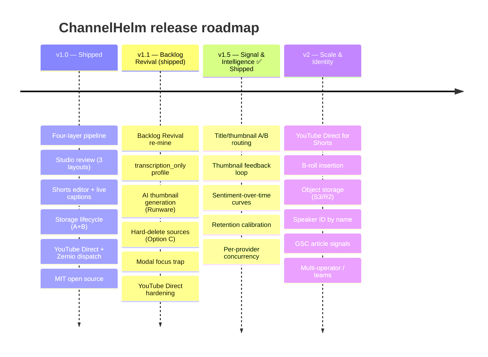

# ChannelHelm Roadmap

This roadmap reflects the milestones already defined in ChannelHelm's technical contract and the items documented as deferred across the codebase. It's a direction, not a contract — priorities and dates are the maintainer's call and may shift. Suggestions and PRs against any of these are welcome.

---

## ✅ v1.0 — Shipped

The current foundation, for context.

| Area | What landed |
|------|-------------|
| **Pipeline** | Four understanding layers (audio · visual · fusion · intelligence) → intelligence brief → asset generation, on a custom `SELECT FOR UPDATE SKIP LOCKED` queue with tunable worker concurrency. |
| **Studio** | Per-package review with scored options, inline edit, on-demand regeneration, and live pipeline status. |
| **Shorts editor** | Word-snap trimming, 6 ASS subtitle animations, live (no-render) subtitle preview, auto-written descriptions, per-clip publishing. |
| **Dispatch** | YouTube Direct (per-brand OAuth), Zernio (social + clips), DojoClaw (editorial). |
| **Storage** | Inline Stage-1 cleanup (Option A) + post-publish archive worker (Option B). |
| **Providers** | Pluggable LLM providers (OpenAI / Anthropic / OpenRouter / Ollama / LM Studio / OpenClaw / Codex CLI) with per-purpose routing + at-rest key encryption. |
| **Project** | MIT licensed, public, documented. |

---

## ✅ v1.1 — Backlog Revival *(shipped)*

The headline feature: **re-mine an existing back catalogue** with the current pipeline + prompts, so old uploads yield fresh publishing kits without re-recording. All of v1.1 has shipped.

| Item | Status | What it does |
|------|--------|--------------|
| **Backlog Revival** | ✅ shipped | `reviveSource(packageId, profile?)` clears the source's jobs and re-runs the whole pipeline in place with the current prompts (defaults to the cheap `transcription_only` profile). `generate_asset` UPSERTs, so assets refresh without losing dispatch history. A **Revive** button lives on the package page. |
| **`transcription_only` profile** | ✅ shipped | A fourth, cheapest processing profile — audio transcription only, no visual phase or diarization. The engine that makes backlog re-runs inexpensive. Selectable on upload and as a brand default. |
| **Hard-delete sources (Option C)** | ✅ shipped | A **Delete video** button removes local + archived media and nulls the paths; Postgres history is kept, and re-render/re-mine fail with a clean error. Completes the storage lifecycle (A + B already shipped). |
| **AI thumbnail generation** | ✅ shipped | Thumbnails are AI-generated images via pluggable image providers (Runware) at `/providers`, with a frame-extraction fallback when none is configured. An LLM turns the package analysis into distinct visual concepts; each renders as a plain + headline-overlay variant for the operator to pick. |
| **Modal focus trap** | ✅ shipped | The modal primitive now focuses the first element on open, cycles Tab/Shift+Tab within, and restores focus on close. |
| **YouTube Direct hardening** | ✅ shipped | CSRF-safe OAuth state table (one-time `consumeOauthState`), encrypted refresh_token with auto-refreshed access tokens, and a Connect / Disconnect / reconnect brand card for the per-brand Direct upload path. |
| **Idempotent re-renders** | ✅ (already in v1.0) | `clip_render` is keyed by `(plan, clip)` + `render_rev` and skips when up to date; `scripts/render-shorts.ts` has `--force`. |

---

## ✅ v1.5 — Signal & Intelligence *(shipped)*

Close the **Helm Signal** feedback loop: stop generating-and-forgetting; observe what performs and feed it back into generation. All of v1.5 has shipped.

| Item | What it does | Notes |
|------|--------------|-------|
| **Title/thumbnail A/B routing** | ✅ **Shipped.** Self-run rotation: the `experiment_tick` worker rotates title + thumbnail variants on the live video, reads views / impressions / CTR from the YouTube Analytics API, and applies the winner — which becomes a positive `voice_example` (losers negative). Native "Test & Compare" isn't in the Data API, so ChannelHelm runs the test itself. | Needs the `yt-analytics.readonly` scope — reconnect brands. |
| **Thumbnail feedback loop** | ✅ **Shipped.** A decided thumbnail experiment writes the winning concept's `visual_prompt` to `voice_examples`; the `thumbnail_concepts` worker biases new concepts toward past winners. | Closes the thumbnail half of the A/B loop. |
| **Sentiment-over-time curves** | ✅ **Shipped.** Lexicon emotion curve over the scene log (no extra inference), stored on `intelligence.sentiment_curve`; the clip planner favours high-arousal peaks and the Studio shows a sparkline. | Cheap; reuses existing data. |
| **Retention calibration model** | ✅ **Shipped.** Least-squares calibration of the predicted engaging-fraction → measured average view %, fit per brand from `collect_signal`'s YouTube Analytics pulls; `analyze_intelligence` applies it (identity until enough samples accrue). | Predicted-retention scores improve as data accumulates. |
| **Per-provider concurrency limits** | ✅ **Shipped.** A `max_concurrent` column on `llm_providers` + a per-provider semaphore so a rate-limited provider isn't hammered by N worker slots. | Set it in `/providers`. |

---

## 🚀 v2 — Scale & Identity

Bigger structural moves once single-operator throughput is no longer the constraint.

| Item | What it does | Notes |
|------|--------------|-------|
| **YouTube Direct for Shorts** | Upload Shorts per-clip via the YouTube Data API instead of only through Zernio. | Requires two dispatches per asset (Zernio still handles TikTok/Instagram). |
| **B-roll insertion** | Honour the `b_roll_enabled` flag — actually composite b-roll into rendered clips. | UI flag exists; rendering deferred. |
| **Object storage** | Optional S3 / R2 backend for media beyond the local NAS export. | Local storage is sufficient for v1 throughput. |
| **Speaker ID by name** | Replace `speaker_01` labels with named identification via a per-brand face/voice index. | Needs more storage + privacy considerations. |
| **GSC article signals** | Pull Search Console position + page metrics for DojoClaw-published articles into the `signals` table. | Completes cross-surface performance data. |
| **Multi-operator / teams** | Team accounts on top of the local-first single-operator model. | Only if content-ops headcount grows. |
| **Higher dispatch-volume path** | The documented upgrade path if dispatch volume outgrows local bandwidth. | Choose when needed. |

---

## 💡 Ideas (unscheduled)

A themed backlog of candidates. Each is tagged **grounded** (scaffolding already exists in the codebase — low-risk) or **bet** (a new product direction), with a rough effort (XS–L). **✅ shipped** marks items already built straight out of this backlog (extended-network generation, long-clip planning, pinned comments, the unified performance dashboard, DojoClaw article signals, comment mining, brand-voice bootstrap, multi-language subtitles).

### Reach multipliers — more output from one video

| Idea | What it is | Type | Effort |
|------|------------|------|--------|
| **Generate for the 8 un-wired networks** | ✅ **Shipped.** Per-network post generation for Facebook, Pinterest, Bluesky, Threads, Reddit, Telegram, Discord & Google Business — gated by the brand's connected Zernio accounts so we never draft a post that can't ship. | ✅ shipped | — |
| **Long-clip planning** | ✅ **Shipped.** `long_clip_plan` now generates horizontal highlight segments; the existing renderer turns them into `rendered_long_clip` and dispatch routes them to YouTube via Zernio. | ✅ shipped | — |
| **Multi-language subtitles** | ✅ **Shipped.** Translate a Short's subtitles to other languages → per-language SRT + ASS sidecar files, reusing the transcript + ASS subtitle pipeline. TTS dubbing and a burned-in per-language re-render are deferred. | ✅ shipped | — |
| **Quote cards / carousels** | Turn the highest-retention lines into image quote-cards + carousels (LinkedIn/Instagram), reusing the image-provider layer built for thumbnails. | bet | M |
| **Per-platform Short captions** | Tailored caption + hashtags per destination. *Deferred* — captions belong to clips, not the package, so this is better built as a `short_clip_plan` enhancement (per-clip caption variants + per-network dispatch) than as standalone asset types. | bet | M |

### Deeper feedback loop — extend Helm Signal

| Idea | What it is | Type | Effort |
|------|------------|------|--------|
| **Comment mining → content loop** | ✅ **Shipped.** Post-publish, on-demand: mine a video's top YouTube comments → `content_ideas` + `faq` assets, from the Studio's "Mine comments" panel. (The `youtube_pinned_comment` asset already generates from the analysis; this makes follow-up content audience-driven.) | ✅ shipped | — |
| **Best-time-to-post** | Learn per-platform optimal windows from the `signals` already collected, and pre-fill the publish scheduler. | bet | S–M |
| **Unified performance dashboard** | ✅ **Shipped.** A new `/performance` route — one cross-surface view of how dispatched/published assets performed (signals + A/B results). | ✅ shipped | — |
| **DojoClaw + GSC article signals** | ✅ **Shipped.** `collect_signal` now has a DojoClaw branch (foundation — degrades to a no-op until DojoClaw exposes an analytics endpoint). GSC OAuth is still deferred. | ✅ shipped | — |
| **Prompt-version A/B** | Apply the A/B machinery to *prompt versions* (e.g. `youtube_title_set.v1` vs `.v2`) — measure which prompt yields better-performing assets. | bet | M |

### Quality & trust

| Idea | What it is | Type | Effort |
|------|------------|------|--------|
| **Prosodic analysis** | `energy_db` / `emphasis_words` are stubbed in the scene log (`workers/kinds/fuse.ts`); a prosody ML pass (energy/pitch/emphasis) sharpens clip + hook selection and pairs with the sentiment curve. | grounded | M |
| **Audio-event detection** | Laughter / music / applause (YAMNet on the Neural Engine) — useful for podcasts and a cheap local *music-presence* signal. | grounded | M |
| **Brand glossary** | A per-brand term list so transcripts + assets spell names, products, and jargon correctly (Whisper mishears proper nouns). | bet | S |
| **Fact-check / claim guard** | Flag unsupported factual claims in generated copy before dispatch (a hallucination guard surfaced in the Studio). | bet | M |
| **Music / copyright detection** | Flag clips likely to carry copyrighted audio before non-YouTube syndication. **A risk predictor, not a verdict** — local detects music *presence* (~90%) not copyright status; real identification needs an opt-in fingerprint API (breaks local-first); YouTube's own pre-publish Checks already cover YouTube. Parked until the trade-off is worth it. | bet | M |

### Operator & business

| Idea | What it is | Type | Effort |
|------|------------|------|--------|
| **Cost tracking & budgets** | Per-package / per-brand spend (LLM tokens + image gen + render time) with optional budget caps. | bet | S–M |
| **Brand-voice bootstrap** | ✅ **Shipped.** `/brands/[id]/voice` seeds `voice_examples` from pasted samples or the brand's existing published assets, so voice quality is good from upload #1 instead of after the loop warms up. | ✅ shipped | — |
| **Bulk / batch ingest** | Drop a folder or paste N URLs → queue the whole backlog at once (pairs with the shipped Backlog Revival). | bet | S |
| **Auto-approve rules** | Per-asset-type trust thresholds (e.g. auto-approve tags above score X) so high-confidence assets skip manual review. | bet | S |

---

## How priorities are set

ChannelHelm is local-first and single-operator by design; the roadmap optimizes for **one person turning more videos into more on-brand output with less manual work**, not for multi-tenant scale. Items move up when they unblock that, and the feedback loop (v1.5) is weighted heavily because it compounds: every shipped asset that gets measured makes the next one better.

Have an idea or a use case that isn't covered? Open an issue. See the in-app guides (`/how-it-works.html`, `/handbook.html`, `/shorts-editor-guide.html`, and the rest, served at `http://localhost:3000`) for how the current system works.
